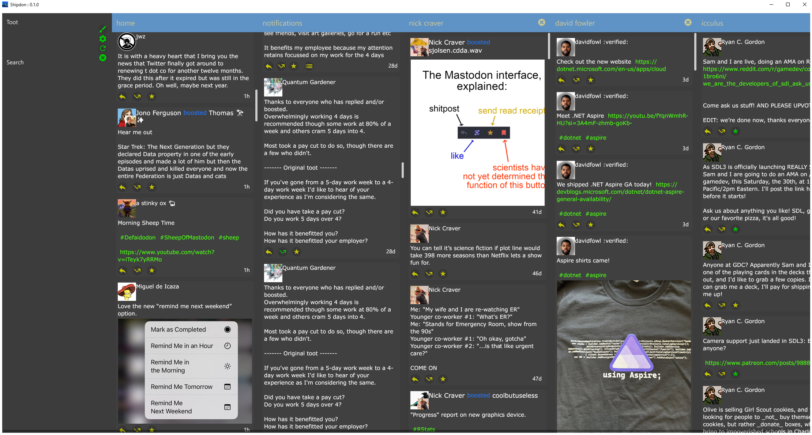

# Shipdon

Shipdon is a Mastodon client which runs on Windows, MacOS and Linux.
It is currently still in development but is stable enough to be a usable client.

## Install

Pre-built binaries will soon be available at https://github.com/kpfaulkner/shipdon 

## Build

Go 1.21 is required to build Shipdon.

To build simple run the make command. Or if make is not installed then: go build .

This will generate a single binary called `shipdon` in the current directory.

Upon first run, Shipdon will request authentication (via OAuth) to your preferred 
Mastodon instance and will create a configuration file in the 
user's home directory called ~/.shipdon/config.yaml

## Screenshots

### Notes:
 Some icons are from https://iconscout.com/free-icon-pack/google-material-vol-1
